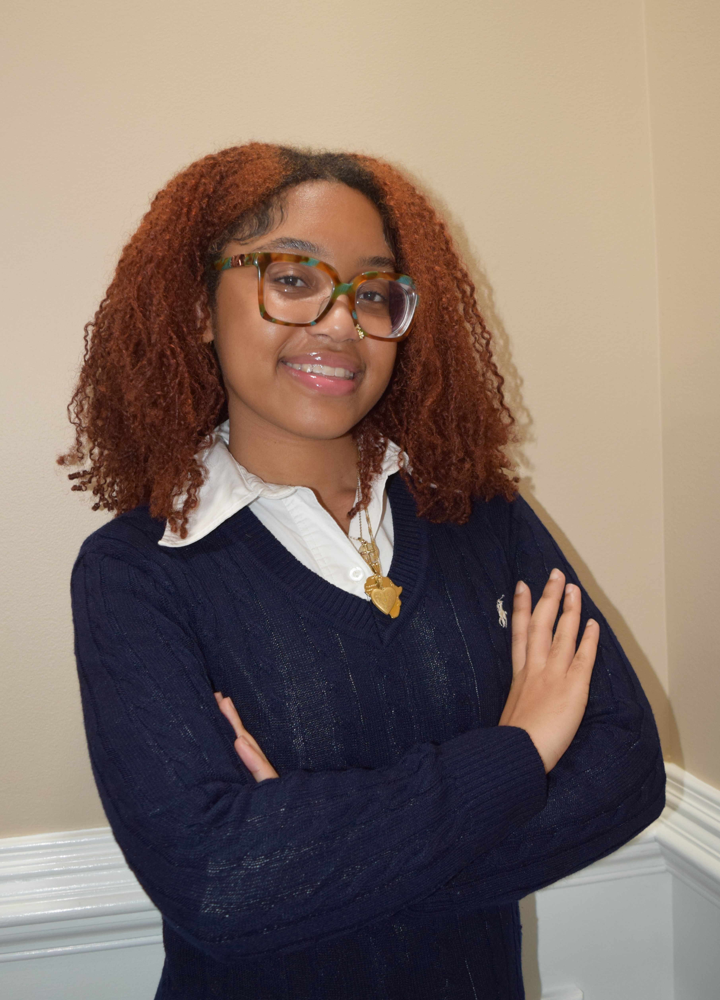

## 👋 Hi, I'm Zerlyne! 

<!--
**Z-Nsimons/Z-Nsimons** is a ✨ _special_ ✨ repository because its `README.md` (this file) appears on your GitHub profile.

Here are some ideas to get you started:

- 🔭 I’m currently working on ...
- 🌱 I’m currently learning ...
- 👯 I’m looking to collaborate on ...
- 🤔 I’m looking for help with ...
- 💬 Ask me about ...
- 📫 How to reach me: ...
- 😄 Pronouns: ...
- ⚡ Fun fact: ...
-->

🎓 Junior CS Major | Cybersecurity Concentration | AI Minor  
🔐 Passionate about offensive/defensive security, automation, and ethical hacking  
💻 Currently building and testing tools in my Linux-based home lab  

## About Me

I'm a junior Computer Science student with a concentration in Cybersecurity and a minor in Artificial Intelligence. I enjoy building tools that detect threats, automate security tasks, and make Linux systems more resilient.  

Currently, I’m working on hands-on projects like SSH log analysis (LogSleuth), real-time IP blocking (BlockSleuth) in my home lab, and building my own PC. I love learning by doing, whether it’s defensive scripting, offensive security research, or experimenting in virtual machines.  

Outside of tech, I'm learning Twi and always looking for ways to combine language, logic, and creativity in everything I do! 

## 📫 Contact
- LinkedIn: [linkedin.com/in/zerlyne-nsimons](https://linkedin.com/in/zerlyne-nsimons)
- GitHub: [github.com/Z-Nsimons](https://github.com/Z-Nsimons)
- Email: z.nandwani.s@gmail.com
